# BFS-Paralel-pada-GPU

##  Deskripsi
Proyek ini berfokus pada implementasi algoritma **Breadth-First Search (BFS)** secara paralel menggunakan GPU. Tujuan utama dari proyek ini adalah untuk menganalisis bagaimana pemilihan **struktur data graph** mempengaruhi performa traversal pada arsitektur paralel.

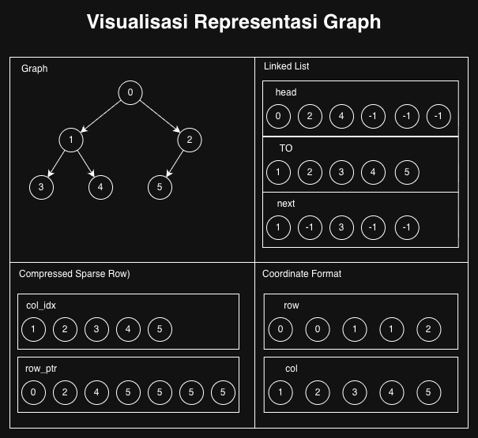

Tiga representasi graph yang dibandingkan dalam penelitian ini adalah:
- Edge List (Adjacency List berbasis array)
- CSR (Compressed Sparse Row)  
- COO (Coordinate Format)  

Dengan menggunakan dataset graph berukuran kecil hingga besar, proyek ini mengevaluasi efisiensi masing-masing representasi dalam konteks komputasi paralel.

---

##  Overview

Traversal graph merupakan operasi fundamental dalam berbagai aplikasi seperti analisis jaringan sosial, sistem rekomendasi, dan pemrosesan data skala besar. Seiring meningkatnya ukuran data, pendekatan sekuensial menjadi kurang efisien, sehingga diperlukan komputasi paralel menggunakan GPU.

Dalam implementasi BFS paralel, performa tidak hanya ditentukan oleh algoritma, tetapi juga oleh cara data graph direpresentasikan di memori. Perbedaan pola akses memori pada setiap representasi dapat berdampak signifikan terhadap:

- Kecepatan eksekusi  
- Efisiensi penggunaan memori  
- Skalabilitas terhadap ukuran graph  

Proyek ini mengeksplorasi hubungan antara **struktur data graph** dan **kinerja BFS paralel**, dengan tujuan menemukan representasi yang paling optimal untuk digunakan pada GPU.

---

##  Tujuan
- Mengimplementasikan BFS paralel pada GPU  
- Membandingkan performa tiga representasi graph  
- Menganalisis dampak ukuran graph terhadap kinerja  
- Mengidentifikasi representasi paling efisien  

---

## Visualisasi Sistem

### 1. Flowchart Implementasi

Flowchart berikut menunjukkan perbedaan alur eksekusi BFS berdasarkan representasi graph dan model komputasi.

---

### 1.1 Linked List

#### Sequential
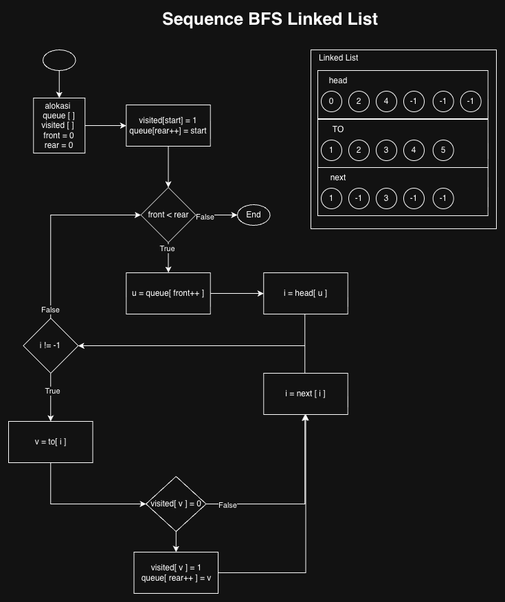

#### Paralel
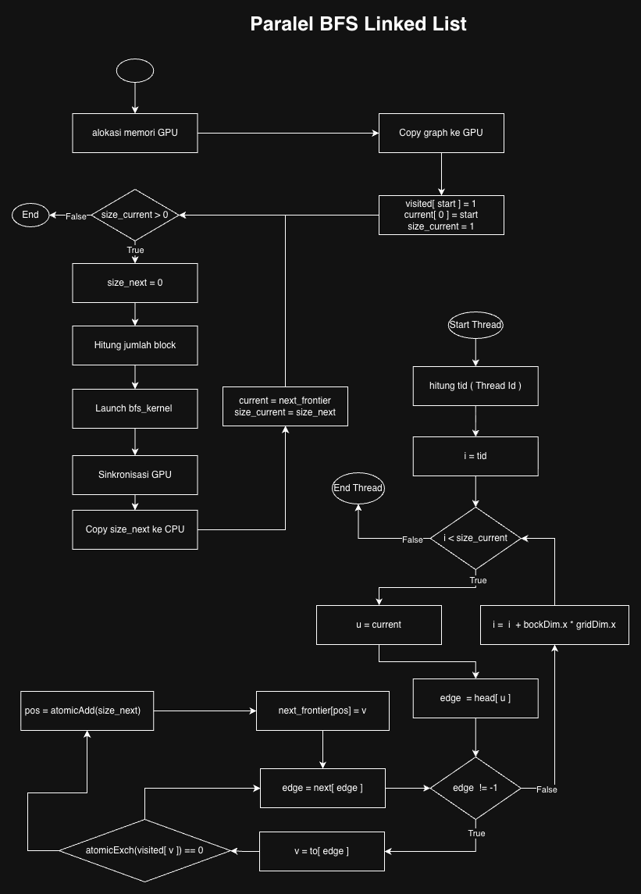

**Insight:**
- Sulit diparalelkan karena pointer chasing  
- Akses memori tidak teratur  
- Kurang cocok untuk GPU  

---

### 1.2 CSR

#### Sequential
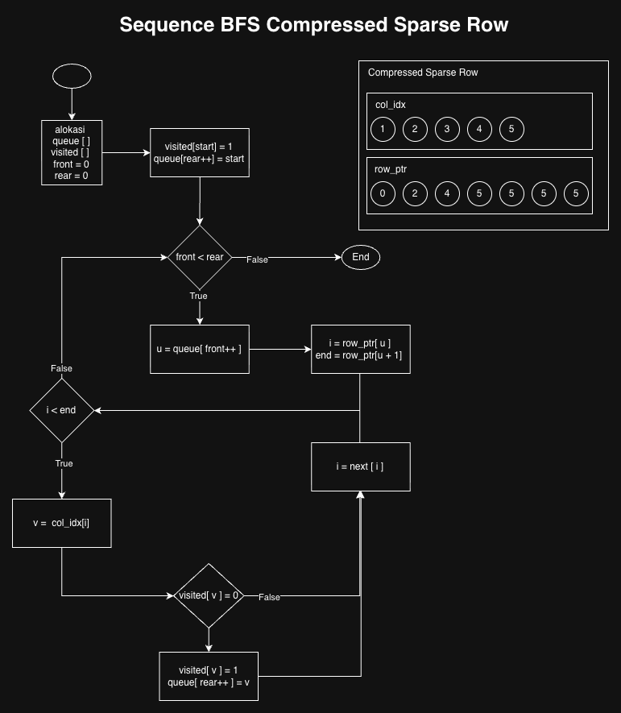

#### Paralel
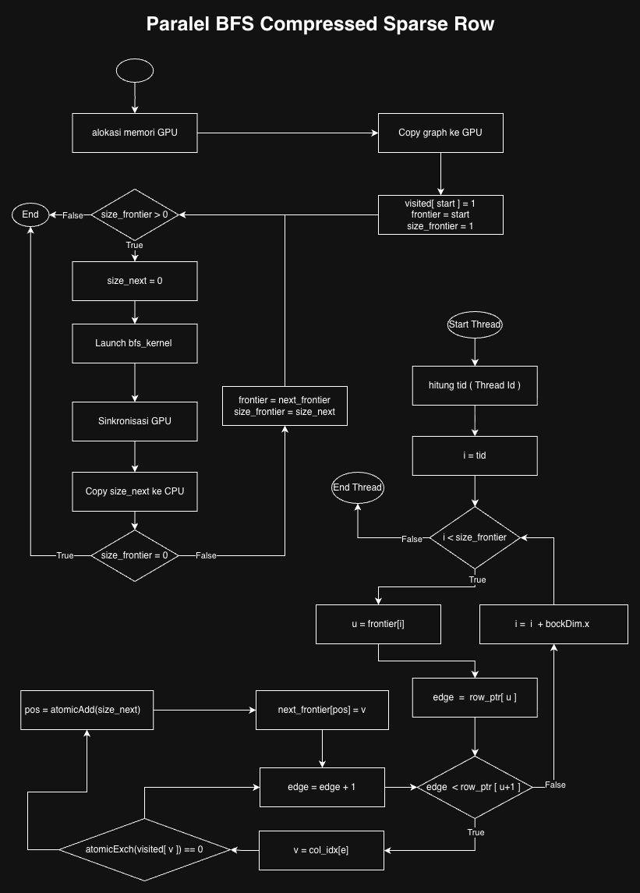

**Insight:**
- Struktur data terkompresi  
- Akses memori lebih teratur  
- Secara teori optimal untuk GPU  

---

### 1.3 COO

#### Sequential
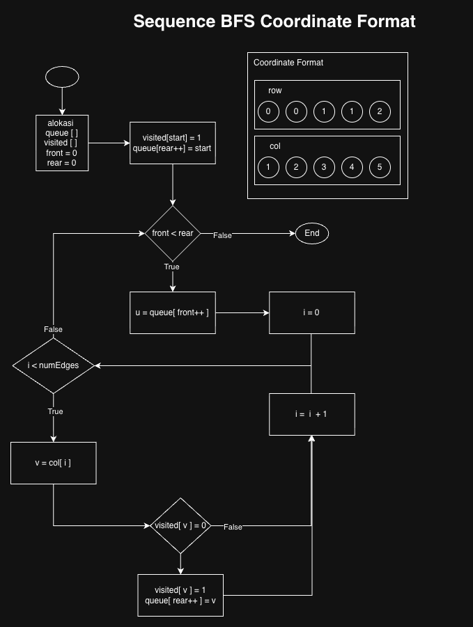

#### Paralel
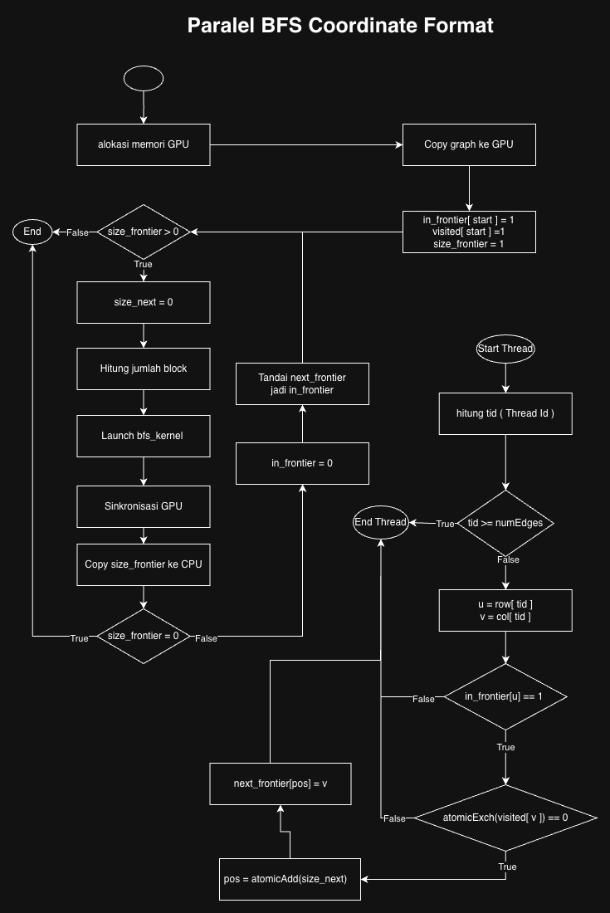

**Insight:**
- Mudah diparalelkan (1 thread = 1 edge)  
- Distribusi workload merata  
- Overhead memori lebih besar  

---

## ⚡ 2. Timeline Paralel

Visualisasi berikut menunjukkan bagaimana thread GPU bekerja pada setiap representasi graph.

#### Linked List
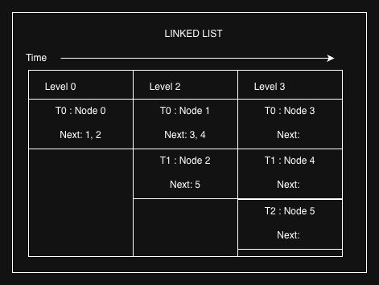

#### CSR
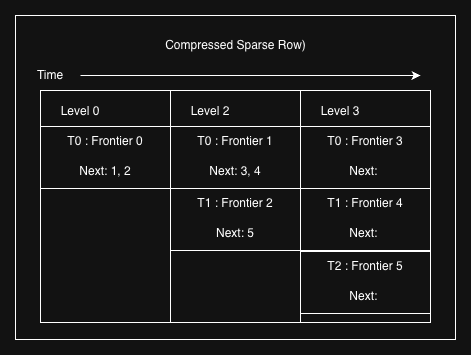

#### COO
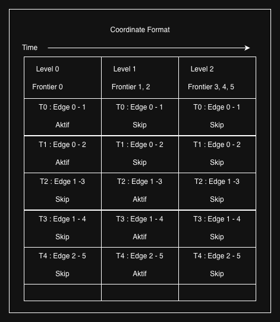

---

##  3. Hasil Profiling

### 3.1 Memcpy Total Bytes
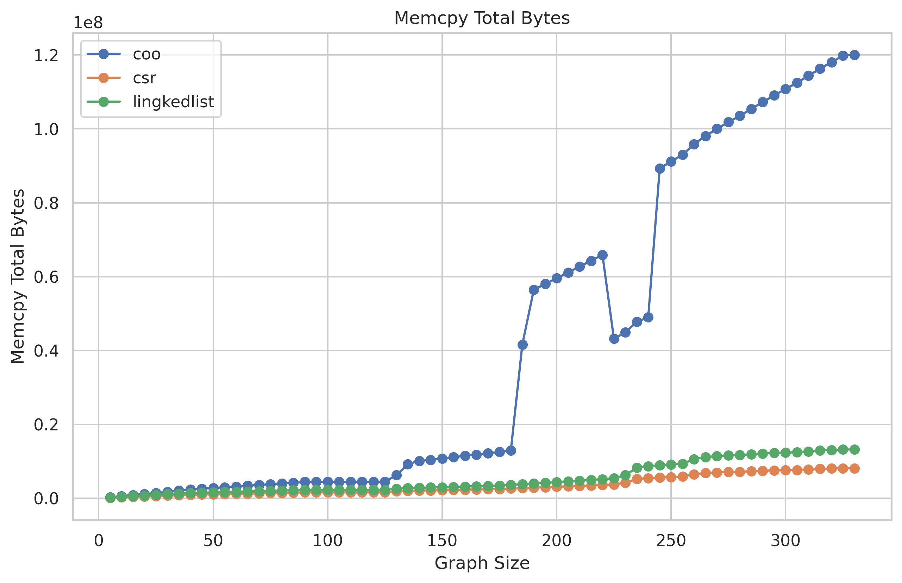

Hasil menunjukkan bahwa:
- **COO memiliki penggunaan memori terbesar**
- CSR paling efisien
- Linked list berada di tengah

Hal ini disebabkan oleh struktur data:
- COO menyimpan edge secara eksplisit dalam dua array (`row`, `col`)
- CSR menggunakan kompresi (`row_ptr`, `col_idx`)
- Linked list memiliki overhead tambahan dari array `next`

Semakin besar data, semakin tinggi biaya transfer CPU ↔ GPU.

---

### 3.2 Memcpy Total Time
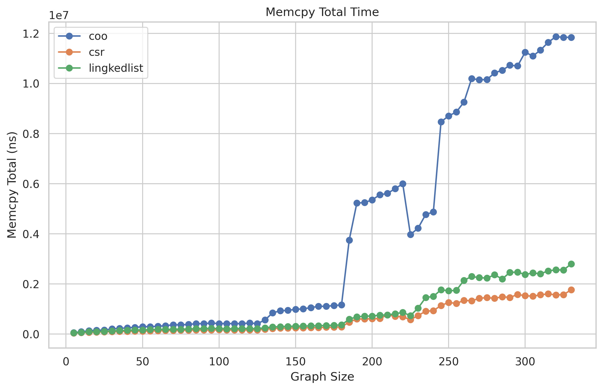

Tren waktu transfer memori sejalan dengan jumlah data yang dikirim. COO menunjukkan waktu transfer tertinggi karena ukuran data yang lebih besar.

---

### 3.3 Kernel Execution Performance
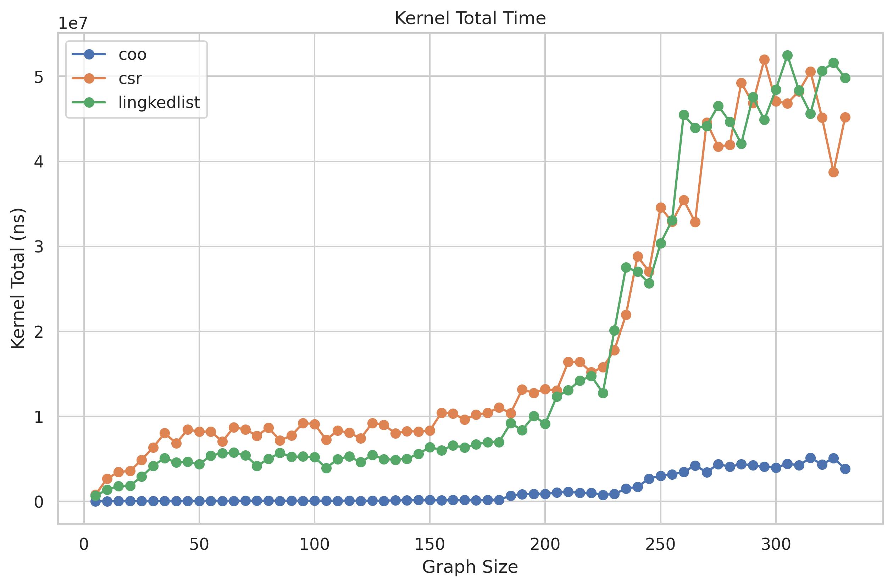

Hasil menunjukkan bahwa **COO memiliki waktu eksekusi kernel paling rendah**.

Alasannya:
- Workload lebih merata (edge-based parallelism)
- Mengurangi idle thread
- Minim load imbalance

Sebaliknya:
- CSR mengalami **load imbalance** karena perbedaan derajat node  
- CSR juga berpotensi mengalami **warp divergence**  
- Linked list mengalami **irregular memory access** akibat pointer chasing  

Efisiensi paralelisme lebih berpengaruh daripada struktur data saja.

---

### 3.4 Total Execution Performance
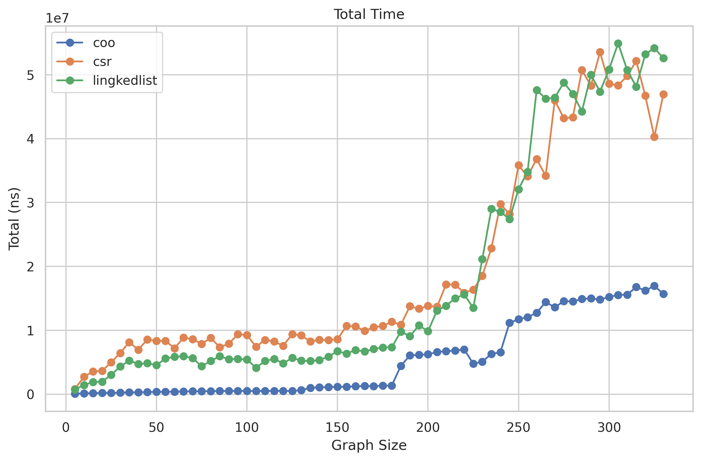

Hasil total (kernel + memcpy) menunjukkan:

- **COO memberikan performa terbaik secara keseluruhan**
- CSR berada di posisi kedua
- Linked list paling lambat

**Insight penting:**
Meskipun COO memiliki overhead memori terbesar, waktu eksekusi kernel yang lebih cepat mampu mengkompensasi biaya tersebut.

Dengan kata lain:

> **Compute efficiency lebih dominan daripada memory efficiency dalam kasus ini**

---

##  Trade-off Analysis

| Representasi | Kernel | Memcpy | Total |
|-------------|--------|--------|-------|
| COO         |  Terbaik | Terburuk |  Terbaik |
| CSR         |  Sedang |  Terbaik |  Sedang |
| Linked List |  Terburuk |  Sedang |  Terburuk |

---

## Scalability Insight

- COO menunjukkan **scaling paling stabil**
- CSR mengalami fluktuasi karena load imbalance
- Linked list memburuk signifikan pada graph besar

Lonjakan performa pada beberapa titik kemungkinan disebabkan oleh:
- pertumbuhan jumlah edge yang tidak linear  
- variasi struktur graph  

---

## Kesimpulan

Eksperimen ini menunjukkan bahwa:

- Representasi graph sangat mempengaruhi performa BFS paralel  
- **COO memberikan performa terbaik secara keseluruhan**  
- CSR tidak selalu optimal dalam implementasi nyata  
- Efisiensi paralelisme lebih penting daripada efisiensi memori  

**Takeaway utama:**

> Dalam GPU computing, cara pekerjaan didistribusikan seringkali lebih penting daripada cara data disimpan.